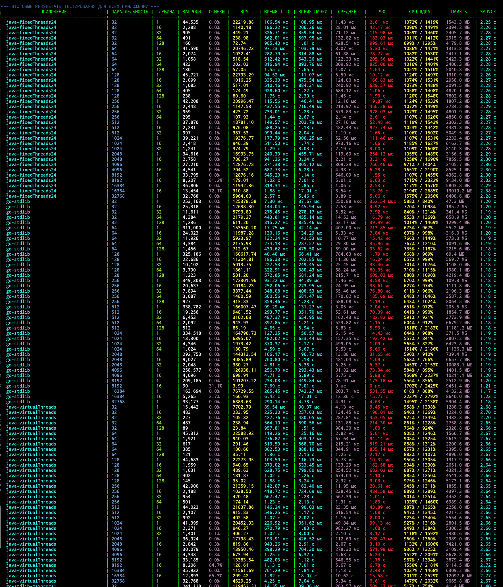
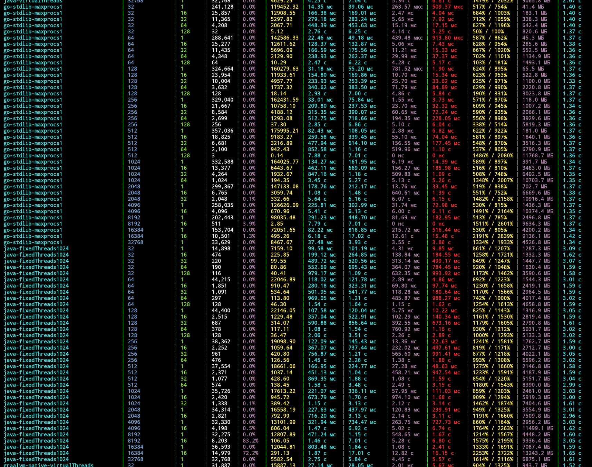
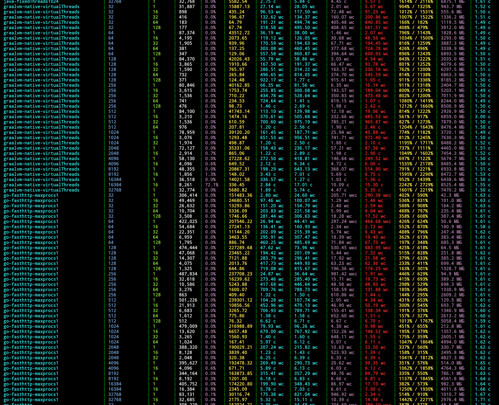
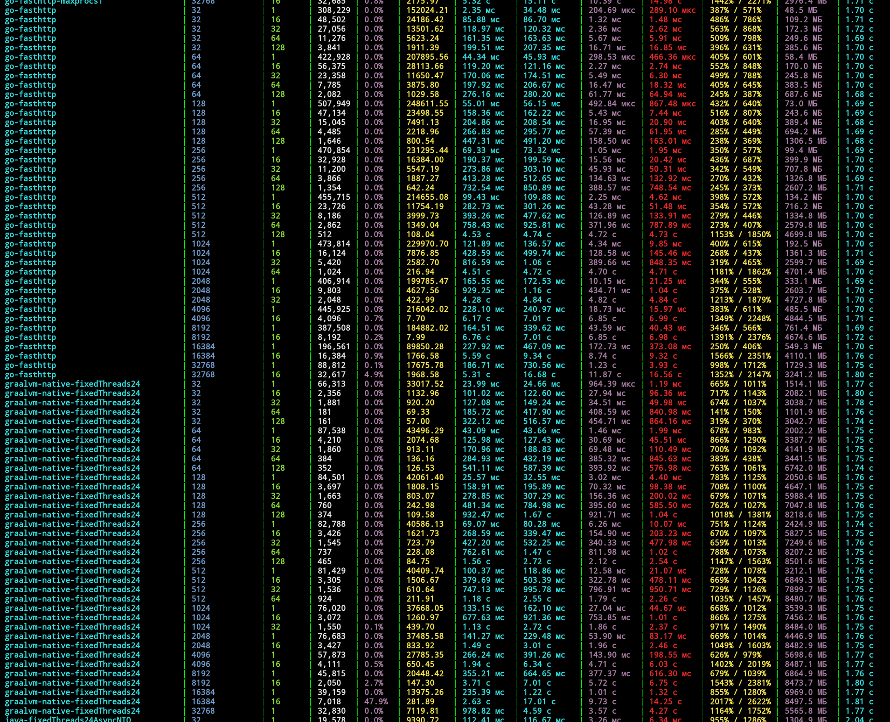
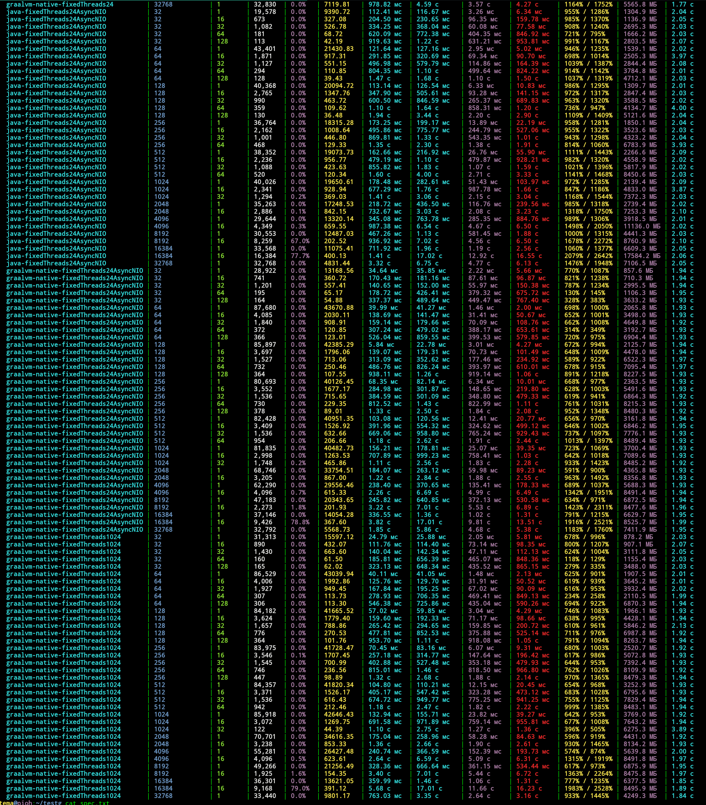

# Утилита нагрузочного тестирования

## Описание проекта

Этот проект представляет собой комплексное решение для нагрузочного тестирования различных приложений с возможностью измерения производительности при разных уровнях параллелизма и глубины запросов. Разработан в мае 2025 года.

### Основные компоненты

1. **Тестовая утилита** (`./load_test/`) - инструмент на Go для проведения нагрузочных тестов с использованием fasthttp для оптимальной производительности.

2. **App-manager** - модуль управления тестируемыми приложениями, отвечающий за запуск, остановку и мониторинг приложений.

3. **Тестируемые приложения** - различные приложения для сравнительного тестирования, включая:
   - Java-приложение с виртуальными потоками
   - Go-приложение

## Принцип работы

### Механизм тестирования

Тестирование происходит матричным способом, с постепенным увеличением как параллельности (количества одновременных запросов), так и глубины вложенности запросов:

```
for (parallel = 1; ; parallel *= 2) {
    for (depth = 1; ; depth *= 2) {
        // Проведение теста с текущими параметрами
    }
}
```

Алгоритм остановки усложнения:

- Если обработка первой пачки параллельности (например, первые 1000 запросов) занимает больше 10 секунд, прекращаем увеличивать сложность для текущего depth
- Для каждого значения parallel находим максимально возможный depth, затем переходим к следующему parallel
- Если при depth=1 система не справляется с текущим parallel, завершаем оба цикла

### Тестируемые приложения

Тестируемые приложения обрабатывают запросы следующим образом:

- Принимают параметры в URL: `left=X&rnd={random()}`
- При каждом запросе уменьшают значение `left` на 1 и делают новый запрос к тому же эндпоинту
- Когда `left` достигает 0, прекращают запросы и возвращают параметр `rnd`

### App-manager

App-manager выполняет следующие функции:

- Запускает приложения и возвращает их PID, ожидая пока приложение запустится и ответит на 100 запросов
- При запуске сохраняет PID и название приложения в файл в корне проекта
- Отслеживает запущенные приложения, обновляя файл с информацией
- Останавливает приложения по требованию
- Хранит список тестируемых приложений и их конфигураций
- Может запустить любое приложение по имени конфигурации
- Возвращает список доступных для запуска приложений

### Сбор метрик

Утилита отслеживает множество показателей:

- Время выполнения первого запроса
- Общее время выполнения для текущей параллельности
- Изменение латентности по секундам
- Использование CPU и памяти (сбор каждые 200мс по PID из app-manager)
- Время запуска приложения (с момента запуска до готовности принимать запросы)
- Перцентили и другие стандартные статистики для нагрузочных тестов
- В каждой строке статистики содержатся данные для каждого приложения/конфигурации

## Использование

Для запуска тестирования используйте команду:

```bash
# Команда запуска будет добавлена после реализации
```

## Структура проекта

```
├── go.mod                # Общий модуль для всего проекта
├── load_test/            # Утилита нагрузочного тестирования
├── app-manager/          # Модуль управления приложениями
├── test-apps/            # Тестируемые приложения
│   ├── java-app/         # Java-приложение
│   └── go-app/           # Go-приложение
└── README.md             # Этот файл
```

## Дополнительная информация

Подробная спецификация требований к проекту находится в файле [spec.txt](./spec.txt).

# Тестовая утилита для нагрузочного тестирования

## Поддерживаемые реализации серверов

### Java

- `java-virtualThreads` - Java с виртуальными потоками
- `java-fixedThreads24` - Java с фиксированным пулом из 24 потоков
- `java-fixedThreads1024` - Java с фиксированным пулом из 1024 потоков
- `java-fixedThreads24AsyncNIO` - Java с фиксированным пулом из 24 потоков и асинхронным NIO

### GraalVM Native

- `graalvm-native-virtualThreads` - Нативная сборка с виртуальными потоками
- `graalvm-native-fixedThreads24` - Нативная сборка с фиксированным пулом из 24 потоков
- `graalvm-native-fixedThreads1024` - Нативная сборка с фиксированным пулом из 1024 потоков
- `graalvm-native-fixedThreads24AsyncNIO` - Нативная сборка с фиксированным пулом из 24 потоков и асинхронным NIO

### Go

- `go-fasthttp` - Go-приложение с использованием библиотеки fasthttp
- `go-stdlib` - Go-приложение с использованием стандартной библиотеки net/http
- `go-fasthttp-maxprocs1` - Go-приложение с fasthttp и ограничением GOMAXPROCS=1
- `go-stdlib-maxprocs1` - Go-приложение со стандартной библиотекой net/http и ограничением GOMAXPROCS=1

## Оптимизации сборки Go-приложений

Для достижения максимальной производительности используются следующие оптимизации сборки:

- `CGO_ENABLED=0` - отключение CGO для статической компиляции и ускорения
- `-ldflags="-s -w"` - удаление отладочной информации для уменьшения размера и ускорения запуска
- `-trimpath` - удаление путей к исходному коду для чистоты сборки
- `-gcflags="-m=2"` - расширенные оптимизации компилятора
- `-tags=netgo,osusergo` - использование чистых Go-реализаций для сетевого стека и пользовательских функций ОС

## Запуск приложения

```bash
# Запуск приложения с fasthttp (по умолчанию)
go build -o build/app main.go
./build/app

# Запуск оптимизированной сборки
CGO_ENABLED=0 go build -ldflags="-s -w" -trimpath -gcflags="-m=2" -tags=netgo,osusergo -o build/app main.go
./build/app --server-type=fasthttp

# Запуск приложения со стандартной библиотекой
./build/app --server-type=stdlib

# Запуск с ограничением GOMAXPROCS=1
GOMAXPROCS=1 ./build/app --server-type=fasthttp
GOMAXPROCS=1 ./build/app --server-type=stdlib
```

## Запуск тестирования

Для запуска тестирования используйте модуль app-manager:

```bash
./app-manager.sh start go-fasthttp
./app-manager.sh start go-stdlib
./app-manager.sh start go-fasthttp-maxprocs1
./app-manager.sh start go-stdlib-maxprocs1
```

## Результаты тестирования

Ниже представлены результаты проведенных нагрузочных тестов для различных типов приложений и конфигураций.










